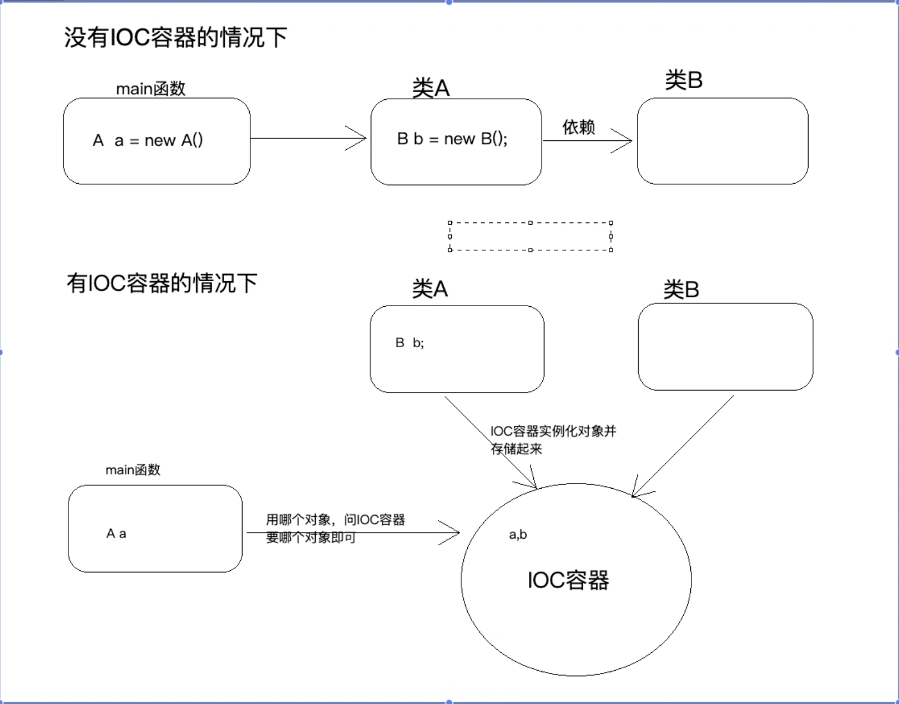
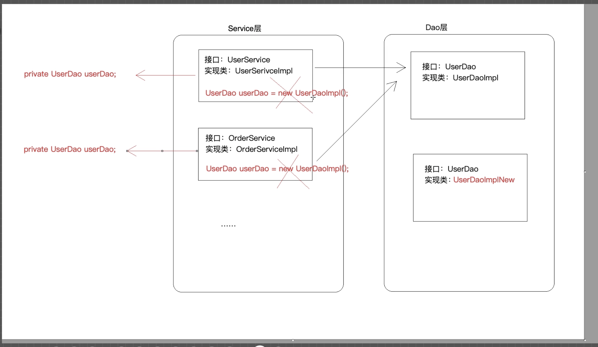
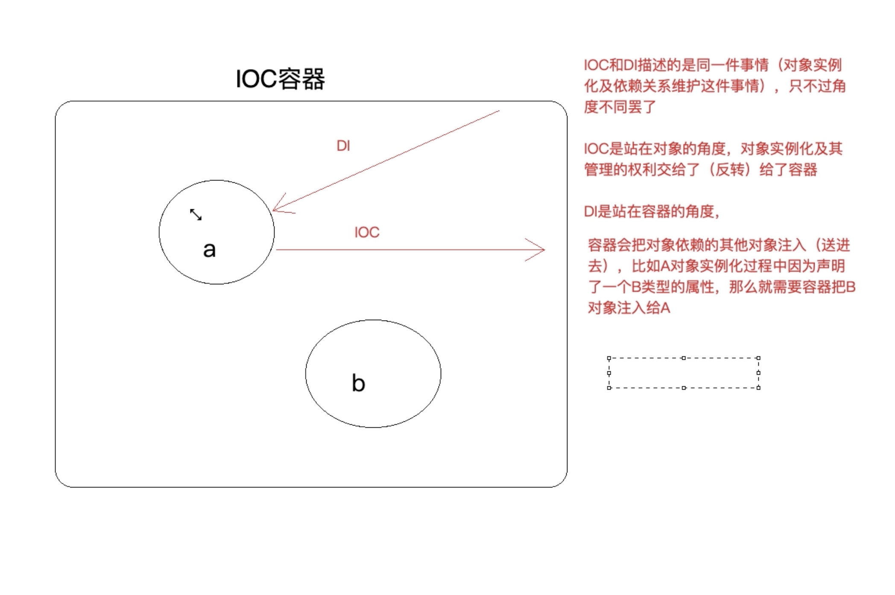
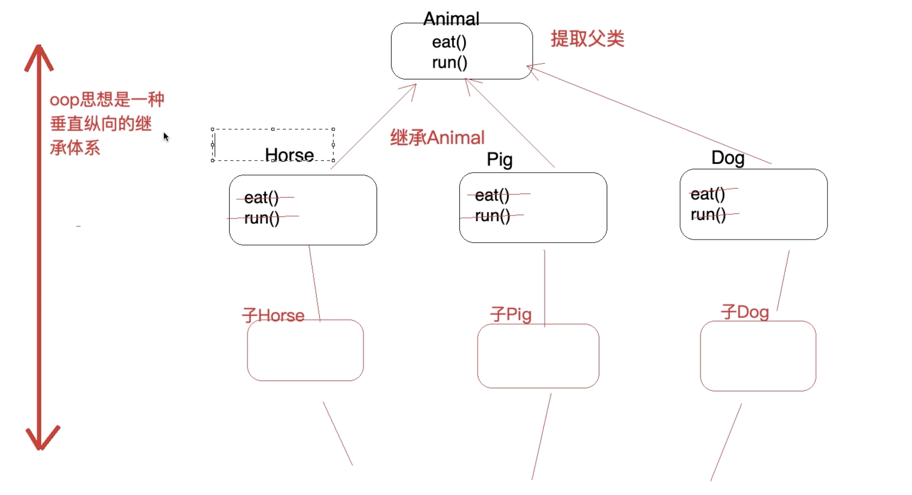
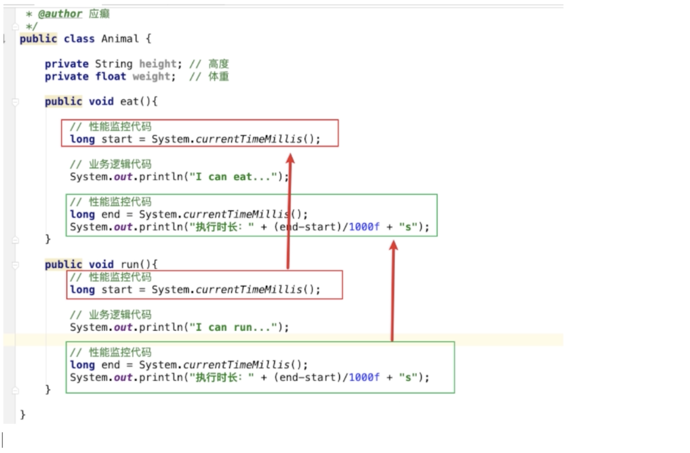
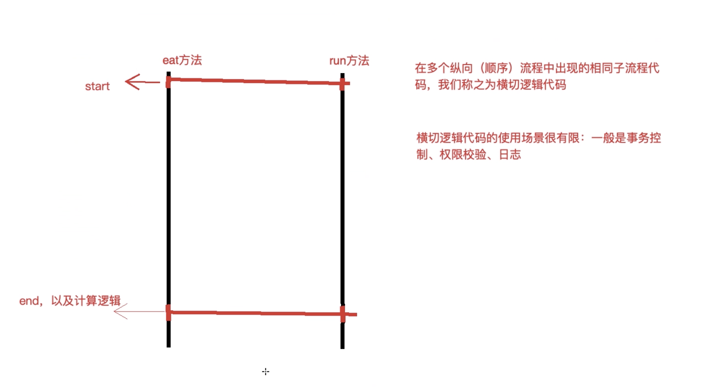
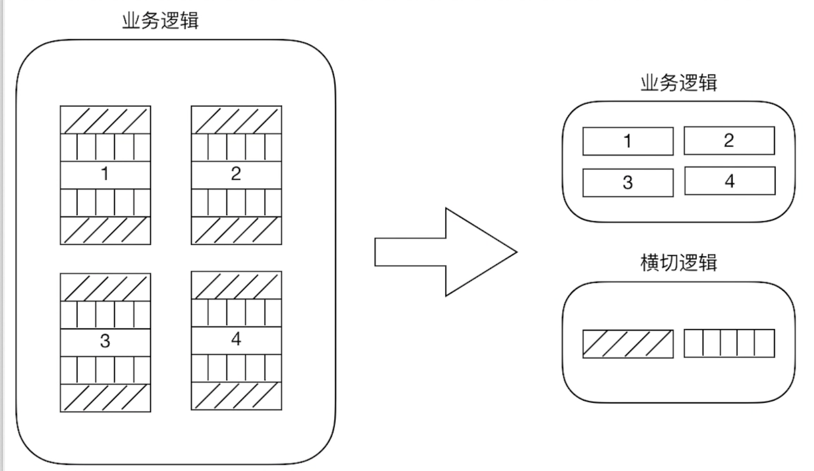

###核心思想
***
ioc和aop在spring之前已经提出,spring是java实现
###第一节IOC
IOC容器替代实例化对象过程中的new对象过程,我们需要的对象可以去IOC容器中获取  
控制:对象创建(实例化,管理的权利)    
反转:控制权交给外部环境(spring框架,IOC容器)  

####IOC和DI
通过new 实现类去获取对象的操作耦合度过高,当业务进行切换时会遇到困难

DI: Dependency Injection(依赖注入)  
IOC和DI描述的是同一件事情(对象实例化及依赖关系维护),只不过角度不一样

###第二节AOP
####2.1什么是AOP
AOP:Aspect Oriented Programming面向切面/方面编程  
是OOP的延续  
OOP:封装,继承,多态

####2.2AOP解决了什么问题
####为什么叫作面向切面编程
OOP解决代码重复问题,纵向的垂直继承体系

OOP的编程思想可以解决大多数的代码重复问题,但是有些情况是解决不了的(横切逻辑代码)

横切逻辑代码存在什么问题:
* 横切代码重复问题  
* 和业务代码混杂在一起,代码臃肿,维护不方便
AOP独辟蹊径,提出横向抽取机制,将横切逻辑代码和业务逻辑代码和业务逻辑代码分析

 ####2.2AOP解决什么问题
 在不改变原有逻辑的基础上,增强横切逻辑代码,根本上解耦合,避免横切逻辑代码重复
 [切]:横切逻辑代码
 [面]:横切逻辑代码往往影响很多的业务逻辑代码,多个点连成的面
