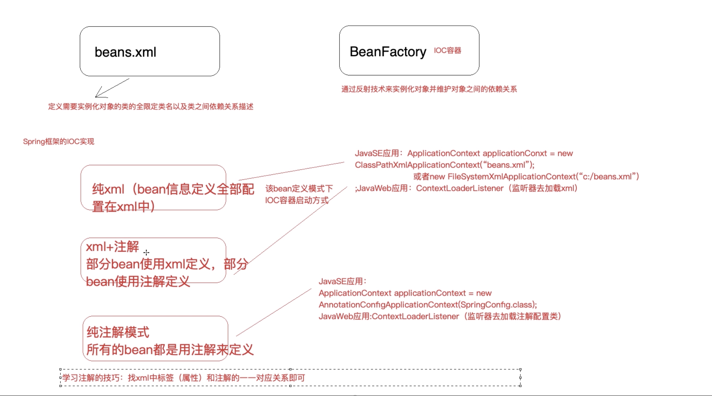

###项目实例
* 遇到的问题

* 思考
1. Class.forName()解决new
2. 使用工厂来反射对象,工厂模式是解耦合的好方法

单表更新操作完成之后事务已经提交,程序中的异常会导致事务处理问题
分析:数据库事务归根结底是Connection的事务,
connection.commit();提交事务
connection.rollback();回滚事务
1) 如果两次update使用两个connection链接,肯定不属于同一个事务
2) 事务控制目前在dao层进行,没有控制在service层

解决思路:
1) 让两次update使用同一个connection链接(ThreadLocal绑定数据库连接到当前线程)
2) 把事务控制添加在service层

* 结合spring

