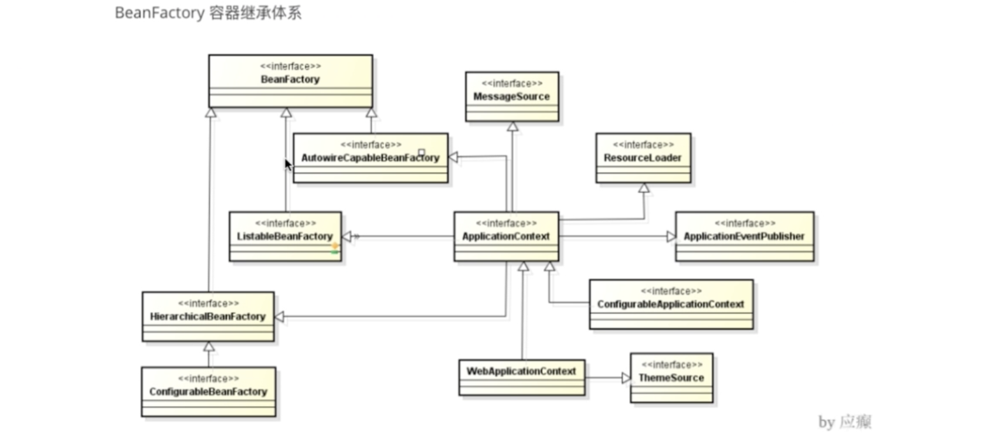
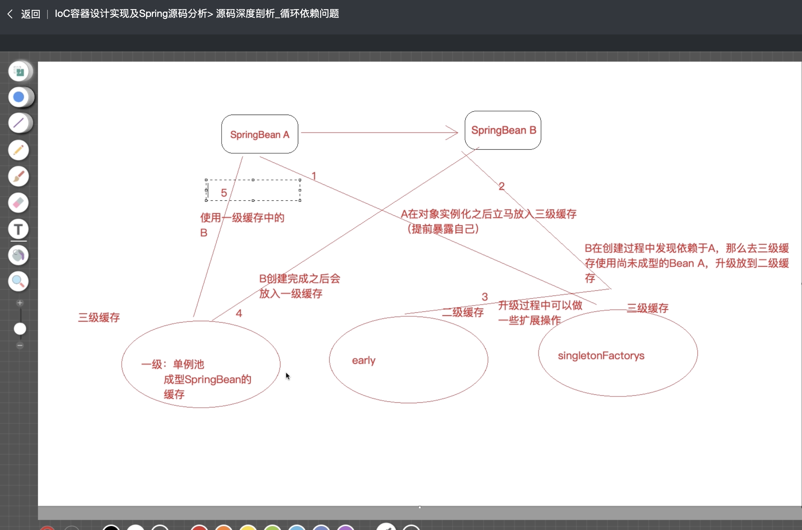
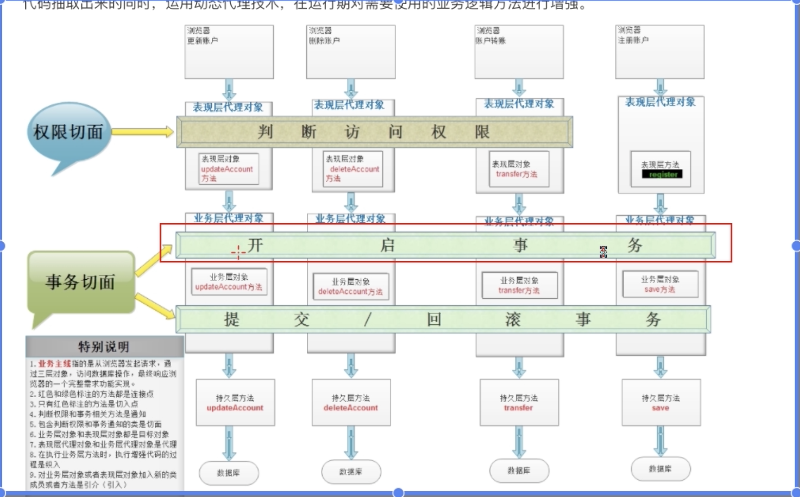
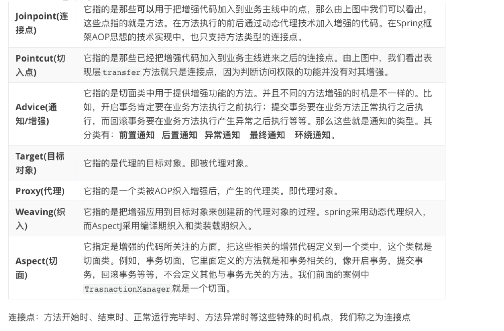
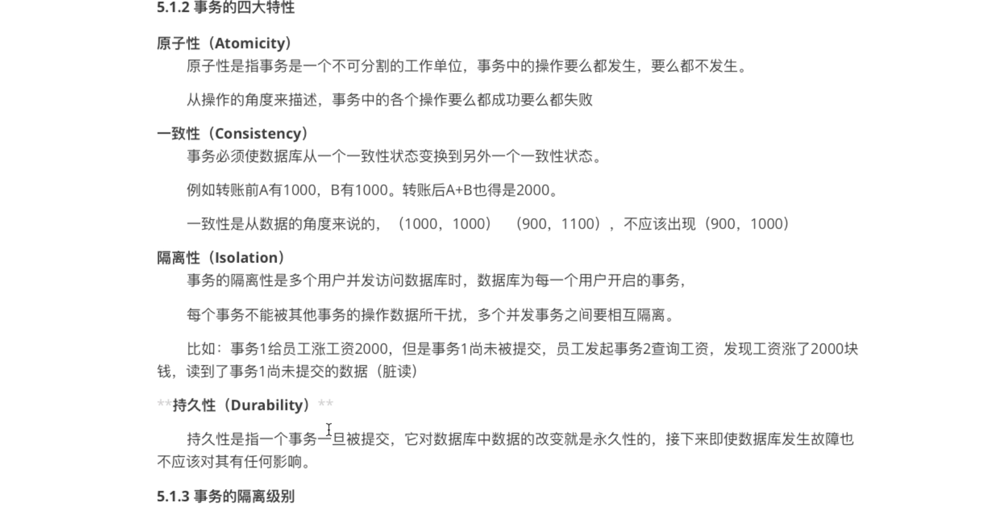
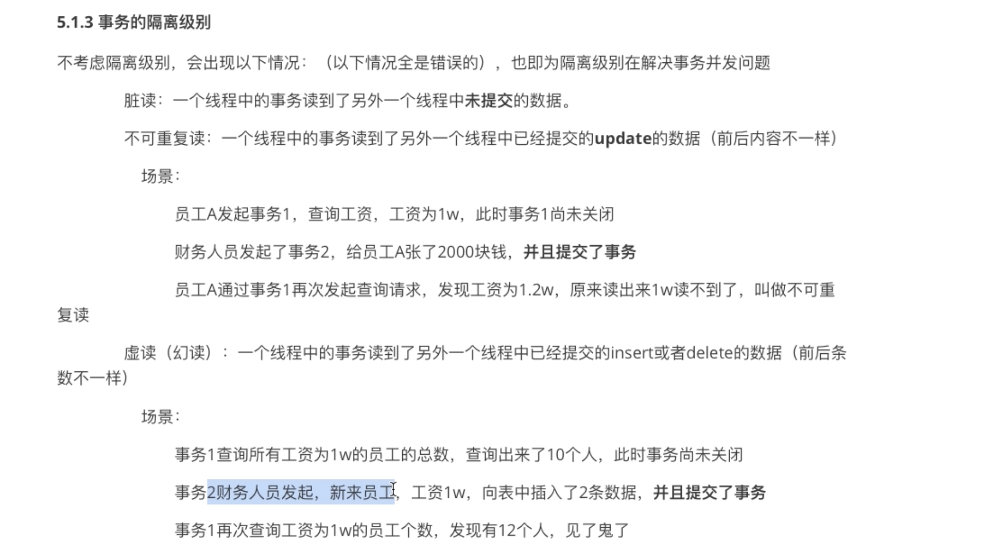
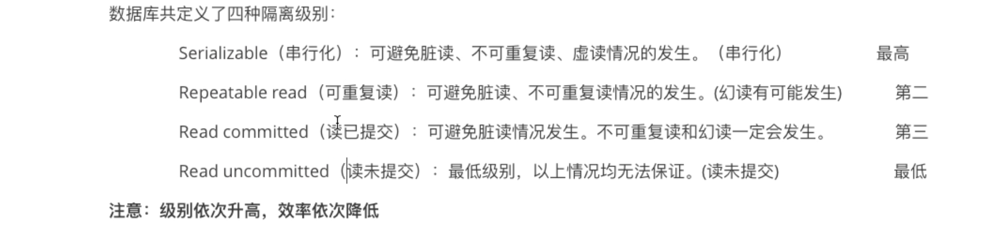
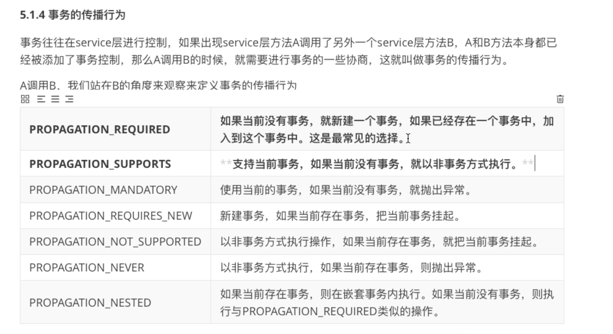

* 好处:提高架构思维,理解框架
* 原则:
1. 定焦(抓主线)
2. 站在上帝视角,关注源码结构和业务流程(淡化细节)
* 方法技巧
1. 断点
2. 反调(find usage)
3. 经验(spring框架中doXXX.具体处理)
* Spring源码构建
1. 下载源码
2. 安装gradle

####循环依赖问题

* AOP相关术语

* 声明式事务支持  
**编程式事务:** 业务代码中添加控制代码  
**声明式事务:** 通过xml或注解配置的方式实现事务
1. 四大特性  
**原子性** 操作角度  
**一致性** 数据角度  
**隔离性** 并发时(脏读:读取未提交数据)  
**持久性** 一旦被提交,永久生效

2. 隔离级别  
**问题:**  
脏读:一个线程读取到了另一个线程尚**未提交**的数据  
不可重复读:一个线程读取到了另一个事务已经提交的update的数据(update前后数据不一致,并在同一个事务中)
幻读:一个线程中的事务读到了另一个线程中已经提交的insert或者delete的数据(前后条数不一样)

3. 隔离级别  
Serializable(串行化)  
Repeatable read(可重复读)update 行加锁  
Read commit(读已提交)  
Read uncommitted(读未提交)

3. 事务传播

####AOP源码

####事务声明源码
