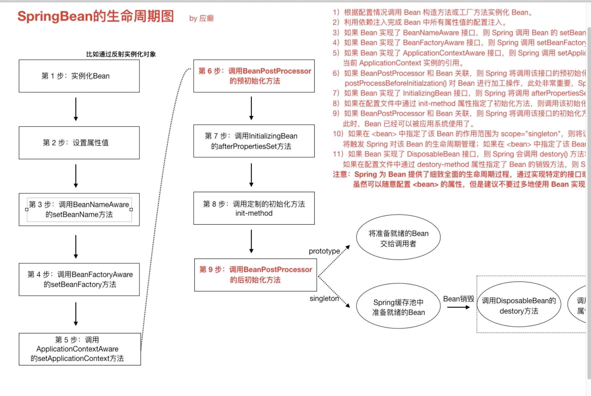
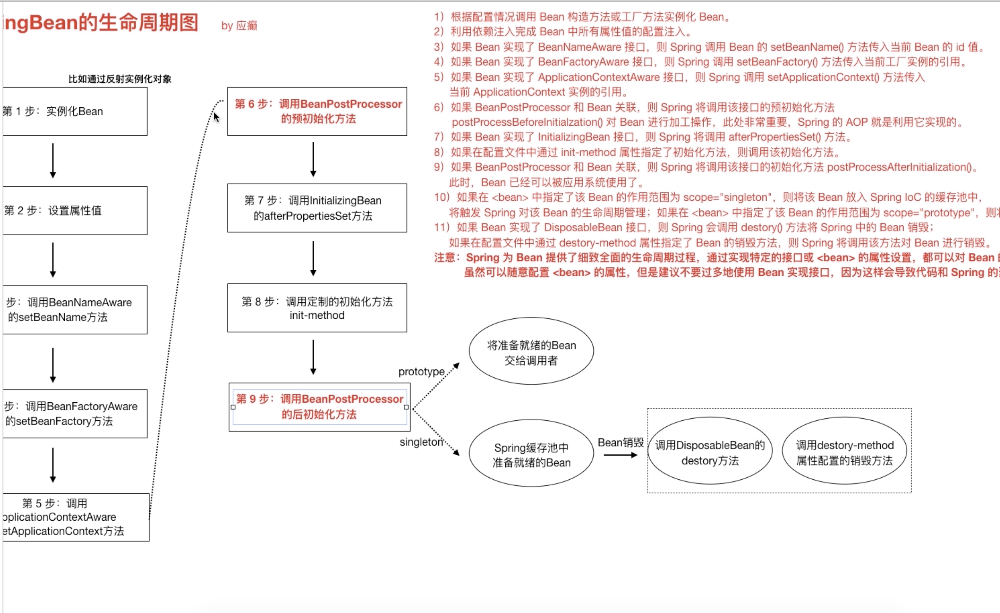

###Spring IOC高级特性
####2.1 lazy-init延迟加载(singleton)
* 一定程度提高启动和运转性能(极少)
* 不常使用的bean开启延迟加载,减少资源占用
####2.2 FactoryBean和BeanFactory
* BeanFactory接口是容器的顶级接口,定义了容器的基本行为,负责生产和管理bean的一个工厂.具体使用它下面的子接口类型,比如ApplicationContext  
spring中的bean有两种,一种是普通bean,一种是工厂bean
* FactoryBean可以生成某一个类型的bean实例,返回给我们.我们可以借助于它自定义bean的创建过程  
类似bean创建的三种方式中的后两种  
```java
public interface FactoryBean<T> {
	@Nullable
  //返回创建的bean实例,如果isSingleton为true,则将结果放入IOC容器的单例缓存池
	T getObject() throws Exception;

	@Nullable
  //返回bean类型
	Class<?> getObjectType();

	default boolean isSingleton() {
		return true;
	}

}
```
####2.2 后置处理器
bean的扩展接口:BeanPostProcessor和BeanFactoryPostProcessor
工厂初始化-->Bean对象
实例化之后通过processor做一些事情
注意:对象不一定是springbean


